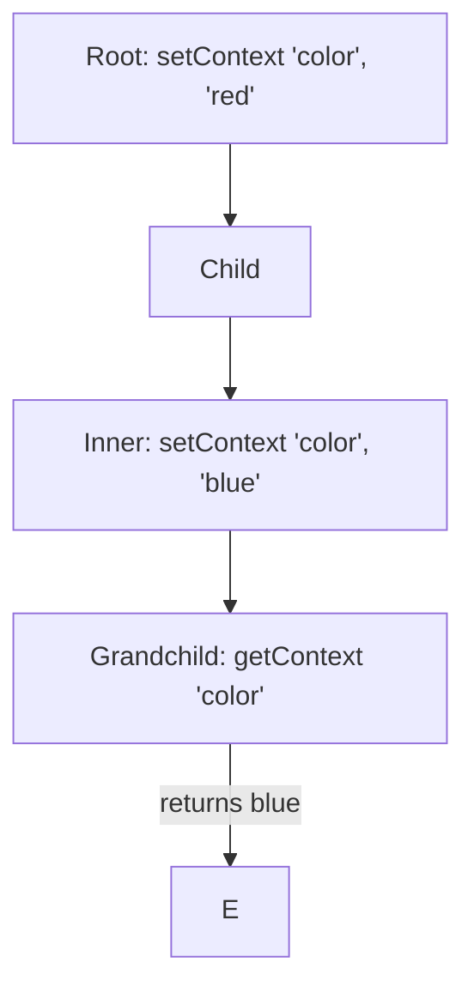

# Context Lifecycle and Reactivity

Understanding *when* and *how* Svelte 5 processes context is critical for building predictable applications. This section explores the initialization timing and how context interacts with the reactivity system.

---

## 1. The Initialization Window

The most important rule of the Context API is that `setContext` and `getContext` **must be called during component initialization**.

### ❌ Fatal Mistake: Async Context
You cannot retrieve context inside an async callback or after the component has finished initializing.

```svelte
<script>
    import { getContext, onMount } from 'svelte';
    
    // ✅ Correct: Called during initialization
    const theme = getContext('theme');

    onMount(() => {
        // ❌ Error: getContext must be called during component initialization
        const lateContext = getContext('user'); 
    });

    async function handleClick() {
        // ❌ Error: getContext must be called during component initialization
        const errorContext = getContext('settings');
    }
</script>
```

### Why this restriction?
Svelte uses the current execution stack to "know" which component is being initialized to look up the correct parent tree. Once the script has run (or enters an async await), that link is lost.

---

## 2. Reactivity in Context

In Svelte 5, **Context itself is not reactive**, but the **values you put inside it** can be.

### ❌ Bad Pattern: Passing Primitives
If you pass a primitive number, children will only see the value it had at the moment `setContext` was called.

```javascript
// Parent
let count = 0;
setContext('count', count); // Children get '0' and never see it change
```

### ✅ Good Pattern: Passing Reactive Objects
Pass an object containing `$state` properties or getters.

```svelte
<!-- Parent.svelte -->
<script>
    import { setContext } from 'svelte';
    let data = $state({ count: 0 });
    
    setContext('counter', data);
</script>

<button onclick={() => data.count++}>Inc</button>
```

```svelte
<!-- Child.svelte -->
<script>
    import { getContext } from 'svelte';
    const data = getContext('counter');
</script>

<p>Count is: {data.count}</p> <!-- Reacts automatically! -->
```

---

## 3. Context and Re-rendering

One of the biggest advantages of Svelte's Context API (especially in Svelte 5) compared to React's Context is **fine-grained updates**.

In React, when a Context Provider's value changes, every component consuming that context re-renders. In Svelte:
1.  Components only "re-render" (execute their reactive effects) if they specifically access a property that changed.
2.  If a child consumes a context object but only uses `data.name`, it won't be affected when `data.age` changes.

> [!NOTE]
> This makes Svelte Context extremely performant for large state objects, as updates only trigger the specific DOM elements that depend on the changed property.

---

## 4. Nesting and Shadowing

Context works by looking up the tree. If multiple parents provide the same key, the nearest parent wins. This is called **Shadowing**.



### Pitfall: Accidental Shadowing
If you use common string keys like `'user'`, you might accidentally overwrite context from a parent component that you didn't even know was providing it. This is why **Symbols** are mandatory for robust apps (see Module 01).

---

## 5. Summary of Timing Pitfalls

| Action | Result |
| :--- | :--- |
| `setContext` in `<script>` | ✅ OK |
| `getContext` in `<script>` | ✅ OK |
| `getContext` in `$effect` | ❌ Error |
| `getContext` in `onMount` | ❌ Error |
| `getContext` after `await` | ❌ Error |

> [!TIP]
> If you need context data in an async function, capture it in a variable during initialization first!
