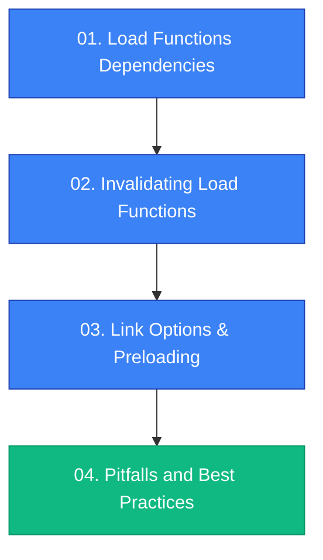

# More About Load Functions

Advanced patterns and techniques for mastering SvelteKit's load functions. This section covers dependency management, invalidation strategies, performance optimization through preloading, and best practices.

---

## 📚 What You'll Learn

This section dives deep into advanced load function concepts that will help you build highly performant, resilient SvelteKit applications.

### Topics Covered

1. **Load Functions Dependencies** - Understanding automatic and custom dependency tracking
2. **Invalidating Load Functions** - Refreshing data with targeted invalidation strategies
3. **Link Options & Preloading** - Optimizing navigation with strategic preloading
4. **Pitfalls and Best Practices** - Avoiding common mistakes and following proven patterns

---

## 🎯 Prerequisites

Before diving into these advanced topics, you should be familiar with:

- ✅ Basic load functions (`+page.js`, `+page.server.js`)
- ✅ Universal vs server-only load functions
- ✅ Layout load functions and data inheritance
- ✅ The `fetch` function and its special properties in SvelteKit

If you need a refresher, review the main [Loading Data](../01.%20Load%20Functions%20Overview.md) documentation first.

---

## 🗺️ Learning Path

### Recommended Order



1. **Start with Dependencies** - Learn how SvelteKit tracks what data needs refreshing
2. **Master Invalidation** - Control when and how data refreshes
3. **Optimize with Preloading** - Create instant navigation experiences
4. **Review Best Practices** - Avoid pitfalls and follow proven patterns

---

## 🔑 Key Concepts

### Dependency Tracking

```javascript
// Custom dependencies
export async function load({ depends, fetch }) {
    depends('app:posts'); // Custom dependency key
    const posts = await fetch('/api/posts').then(r => r.json());
    return { posts };
}
```

### Invalidation

```javascript
import { invalidate, invalidateAll } from '$app/navigation';

// Targeted invalidation
await invalidate('app:posts');

// Global invalidation
await invalidateAll();
```

### Preloading

```svelte
<!-- Declarative preloading -->
<a href="/blog" data-sveltekit-preload-data="hover">Blog</a>

<!-- Programmatic preloading -->
<script>
    import { preloadData } from '$app/navigation';
    await preloadData('/dashboard');
</script>
```

---

## 🎓 What You'll Master

After completing this section, you'll be able to:

- ✅ **Control data freshness** with precise dependency tracking
- ✅ **Optimize refresh strategies** using targeted invalidation
- ✅ **Create instant navigation** through strategic preloading
- ✅ **Avoid common pitfalls** in load function implementation
- ✅ **Implement advanced patterns** like fine-grained invalidation

---

## 📖 Quick Reference

| Topic | Key Tools | Use Case |
|:------|:----------|:---------|
| **Dependencies** | `depends()`, `parent()` | Track what triggers re-runs |
| **Invalidation** | `invalidate()`, `invalidateAll()` | Refresh data on demand |
| **Preloading** | `preloadData()`, `preloadCode()` | Instant page transitions |

---

## 🚀 Ready to Start?

Begin with [01. Load Functions Dependencies](./01.%20Load%20Functions%20Dependencies.md) to understand how SvelteKit tracks and manages data dependencies.
